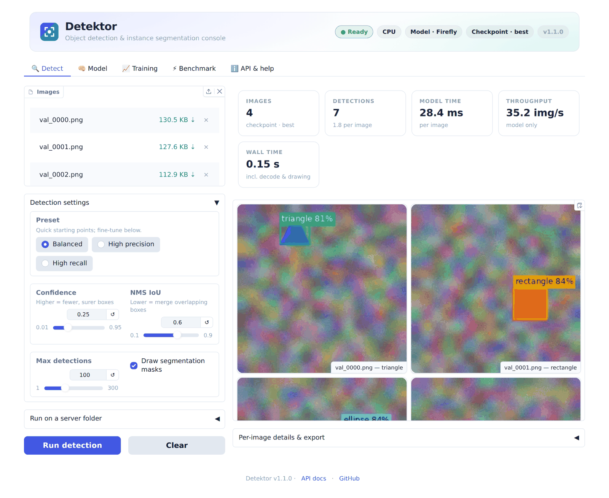
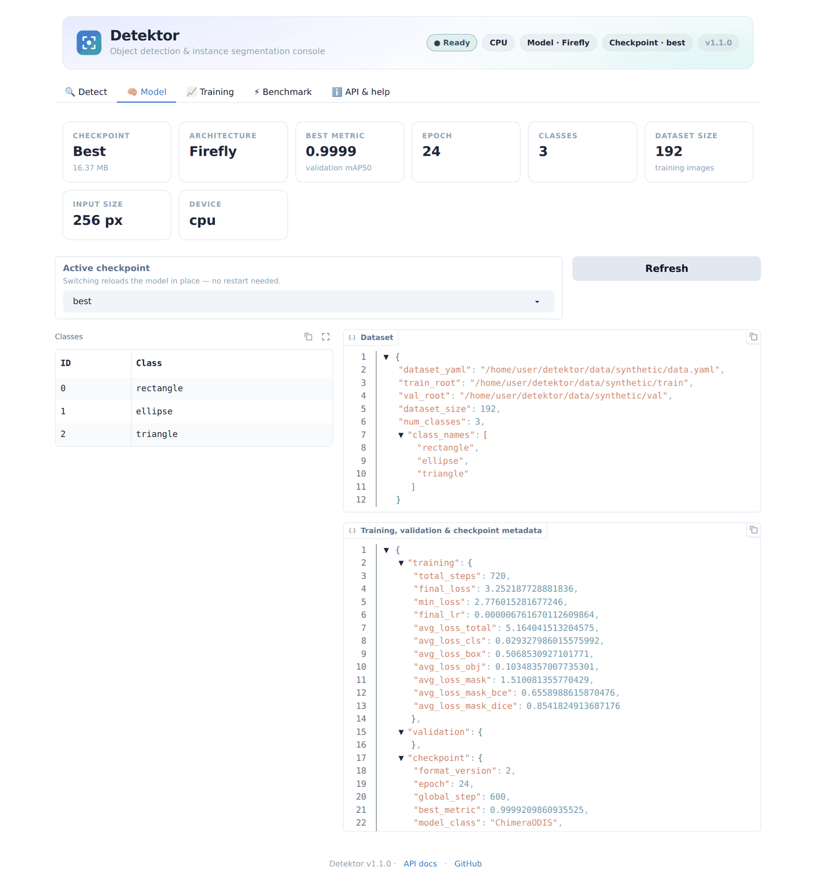
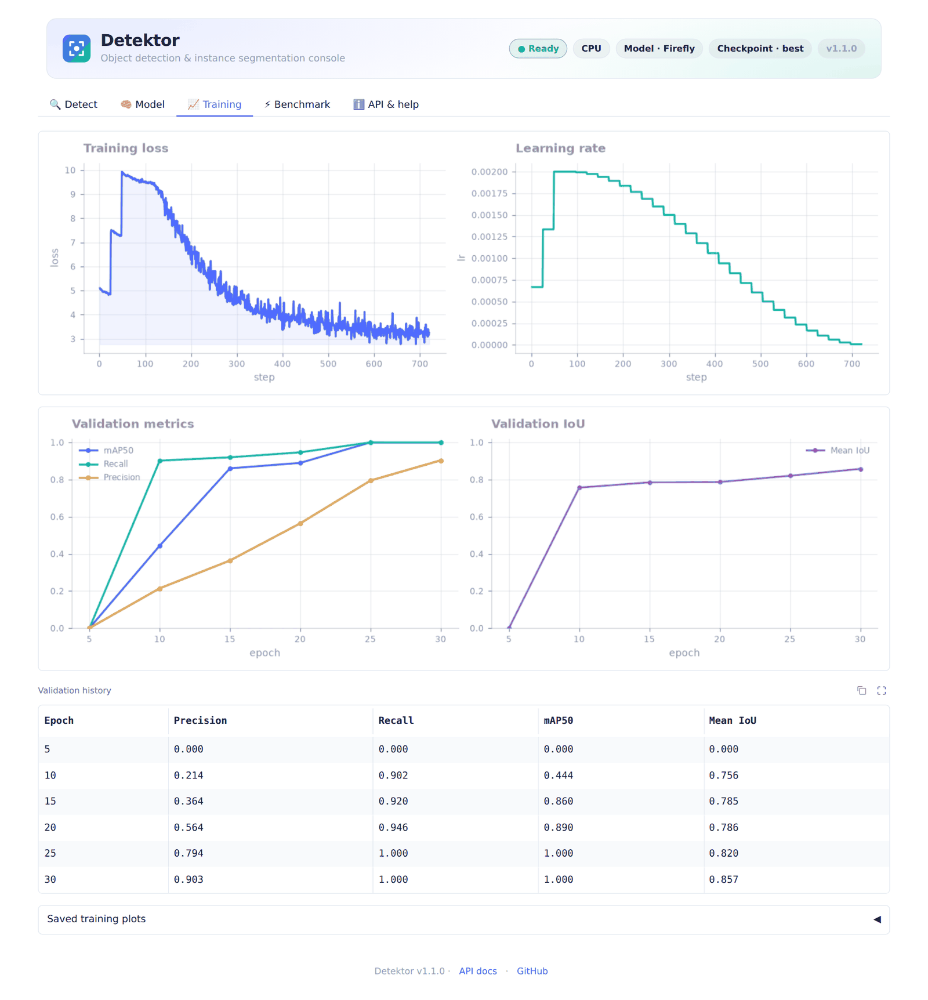
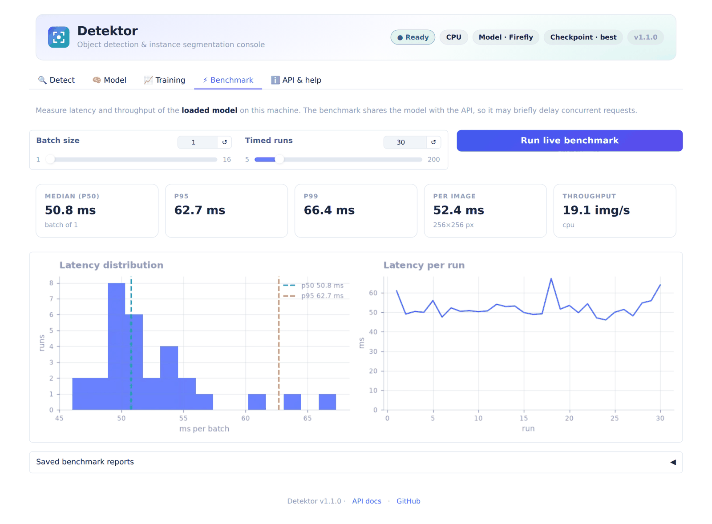

<div align="center">

# Detektor

**Local-first object detection & instance segmentation — train, evaluate, serve and benchmark on a single machine.**

[](https://github.com/Kartik-A-1820/detektor/actions/workflows/ci.yml)
[](LICENSE)


<picture>
  <source media="(prefers-color-scheme: dark)" srcset="docs/assets/ui-detect-dark.png">
  
</picture>

<sub>The built-in console (light/dark), default settings with mask overlay, using the model from the quick start below (30 epochs on the bundled synthetic dataset).</sub>

</div>

---

## Why Detektor

- **One repo, whole lifecycle.** Dataset preflight → hardware‑aware training → evaluation → packaging → REST API + web console → ONNX export → benchmarks.
- **Runs where you are.** Six architecture profiles (≈1.4 M – 15 M parameters) scale from CPU‑only machines to larger GPUs; training auto‑configures itself from your free VRAM/RAM and dataset size (tuned on a 4 GB GTX 1650 Ti).
- **Detection *and* instance segmentation** from one model, auto‑detected from your labels.
- **Production plumbing included.** API‑key auth, request limits, Prometheus metrics, health/readiness probes, hot‑swappable checkpoints, non‑root Docker image, CI.
- **Measured, not claimed.** An eleven‑suite benchmark framework with a regression gate; every number in this README is reproducible with one command (see [Benchmarks](#benchmarks)).

## Quick start

> Requires Python 3.10+ (CI runs 3.11 and 3.12) and PyTorch 2.1+. A GPU is optional.

```bash
git clone https://github.com/Kartik-A-1820/detektor && cd detektor
python -m venv .venv && source .venv/bin/activate
pip install -r requirements.txt          # GPU: install a CUDA build of torch first (pytorch.org)
python -m scripts.run_smoke_checks       # sanity check
```

### No dataset yet? Try the whole pipeline in ~10 minutes (CPU)

```bash
python -m benchmarks.synthetic --out data/synthetic                # 192 + 48 seeded images, 3 classes
python train.py --data-yaml data/synthetic/data.yaml --device cpu --model firefly \
       --img-size 256 --batch-size 8 --epochs 30 --num-workers 0 --no-auto-tune \
       --run-val --val-freq 5 --out-dir runs/demo
python serve.py --weights runs/demo/chimera_best.pt --ui           # → http://127.0.0.1:8000/ui
```

Open the console, drop a few images from `data/synthetic/val/images`, optionally tick *Draw segmentation masks*, and press *Run detection*. (The server automatically runs the model at the 256 px it was trained at.)

### With your own data (YOLO / Roboflow format)

```bash
python check_dataset.py --data-yaml /data/data.yaml            # catch label/image problems first
python train.py         --data-yaml /data/data.yaml            # auto-tuned to your hardware
python validate.py      --weights runs/chimera/chimera_best.pt --data-yaml /data/data.yaml --compute-ap50-95
python infer.py         --weights runs/chimera/chimera_best.pt --source photo.jpg --data-yaml /data/data.yaml
python serve.py         --weights runs/chimera/chimera_best.pt --ui
```

### Docker

```bash
cp .env.example .env && mkdir -p artifacts && cp runs/chimera/chimera_best.pt artifacts/model.pt
docker compose up --build            # http://localhost:8000  (GPU: docker compose --profile gpu up detektor-gpu)
```

## Web console

<table>
<tr>
<td width="50%"><br><sub><b>Model</b> — checkpoint switching, metadata, classes</sub></td>
<td width="50%"><br><sub><b>Training</b> — loss/LR curves and validation history</sub></td>
</tr>
<tr>
<td colspan="2"><br><sub><b>Benchmark</b> — live latency/throughput of the loaded model, plus saved benchmark reports</sub></td>
</tr>
</table>

`python serve.py --weights … --ui [--ui-auth user:password]` mounts the console at `/ui`. It offers presets
(*Balanced / High precision / High recall*), a recursive folder mode, per‑class consistent colour‑blind‑safe overlays,
JSON export and light/dark themes. Run it against a remote API with `python -m ui.app`.

## REST API

```bash
curl http://localhost:8000/ready
curl -X POST "http://localhost:8000/v1/predict?conf_thresh=0.3&include_masks=false" \
     -H "X-API-Key: $DETEKTOR_API_KEY" -F "image=@photo.jpg"
```

```json
{ "request_id": "7c6f…", "num_detections": 2, "image_width": 1024, "image_height": 768, "inference_time_ms": 42.3,
  "detections": [ {"box": [112.4, 80.1, 305.9, 410.0], "score": 0.93, "label": 0},
                  {"box": [500.2, 212.7, 640.8, 399.5], "score": 0.88, "label": 3} ] }
```

| Endpoint | Purpose |
| --- | --- |
| `POST /v1/predict`, `POST /v1/predict_batch` | Single / multi‑image inference (optional base64 PNG masks) |
| `GET /health` · `/ready` · `/version` | Liveness, readiness (model + warm‑up), version |
| `GET /metrics` · `/metrics/prometheus` | JSON and Prometheus metrics (latency histogram) |
| `GET /runtime` · `POST /runtime/select_model` | Active run metadata, hot‑swap `best`/`last` checkpoint |

Security & operations: API‑key auth, CORS allow‑list, body/upload limits (413/400), decompression‑bomb guard,
request‑ID propagation, bounded concurrency. Full reference: [docs/reference/API.md](docs/reference/API.md) ·
configuration: [docs/reference/CONFIGURATION.md](docs/reference/CONFIGURATION.md) · hardening:
[SECURITY.md](SECURITY.md).

## Architecture profiles

`ChimeraODIS` is an anchor‑free, multi‑task network (CSP backbone → PAN‑FPN neck → decoupled head + prototype masks).
Training picks a profile from your hardware; override with `--model`. See [docs/ARCHITECTURE.md](docs/ARCHITECTURE.md).

| Profile | Params (M) | GFLOPs @320 | GFLOPs @512 | FP32 size (MB) | Typical use |
|---|---|---|---|---|---|
| firefly | 1.40 | 1.70 | 4.36 | 5.32 | CPU / ultra-low-memory |
| comet | 2.47 | 2.83 | 7.24 | 9.43 | 4 GB GPUs, small datasets |
| nova | 4.70 | 5.69 | 14.57 | 17.93 | Small/medium runs |
| pulsar | 9.13 | 10.28 | 26.32 | 34.81 | Mid-tier GPUs |
| quasar | 9.61 | 10.38 | 26.56 | 36.66 | Larger GPUs |
| supernova | 15.00 | 16.72 | 42.80 | 57.22 | Highest capacity |

## Benchmarks

Measured with the bundled framework — `python -m benchmarks run --suites all --profiles all` — on:
**Xeon CPU @ 2.10GHz, 4 vCPU, 16 GB RAM, PyTorch 2.14.1, ONNX Runtime 1.30.0, Python 3.11.15**. Random‑initialised weights for speed/size/memory (they depend on the architecture, not the learned
values). The host is a shared VM, so expect roughly ±15 % run‑to‑run noise (neighbouring rows can swap order). Full tables, methodology and caveats: **[docs/BENCHMARKS.md](docs/BENCHMARKS.md)**; raw data in
[`benchmarks/results/`](benchmarks/results/).

### Single‑image latency (batch 1, 1280×720 JPEG input, CPU)

| Profile | Input | Decode+resize | Forward | **Predict p50** | Predict p95 | Predict p99 | FPS | 100 dets + masks | 100 dets, boxes only |
|---|---|---|---|---|---|---|---|---|---|
| firefly | 320 | 6.3 | 29.5 | 33.8 | 50.8 | 67.6 | 27.3 | 272.8 | 50.4 |
| comet | 320 | 5.2 | 36.7 | 30.7 | 37.0 | 47.4 | 31.0 | 263.2 | 58.2 |
| nova | 320 | 5.3 | 50.6 | 50.6 | 62.6 | 65.2 | 19.6 | 274.9 | 72.3 |
| pulsar | 320 | 5.1 | 58.9 | 64.6 | 84.8 | 109.4 | 14.7 | 283.7 | 93.4 |
| quasar | 320 | 5.4 | 61.6 | 63.5 | 87.8 | 88.6 | 14.9 | 290.9 | 84.3 |
| supernova | 320 | 6.2 | 89.2 | 92.2 | 117.3 | 135.3 | 10.6 | 324.7 | 119.4 |
| firefly | 512 | 5.4 | 47.3 | 44.9 | 56.0 | 63.0 | 21.9 | 314.0 | 69.1 |
| comet | 512 | 5.3 | 63.7 | 61.8 | 90.4 | 116.3 | 15.1 | 351.1 | 86.5 |
| nova | 512 | 5.4 | 87.1 | 86.1 | 114.7 | 125.2 | 10.9 | 366.8 | 111.2 |
| pulsar | 512 | 6.1 | 117.7 | 118.4 | 140.8 | 153.4 | 8.3 | 402.9 | 168.5 |
| quasar | 512 | 5.3 | 129.9 | 124.0 | 170.7 | 181.2 | 7.6 | 394.5 | 136.9 |
| supernova | 512 | 5.4 | 175.8 | 178.1 | 208.5 | 211.5 | 5.5 | 473.1 | 218.9 |

_Milliseconds, median unless noted; "Predict" = forward + post-processing at the default threshold (idle case). The last two columns force 100 detections on a 1280×720 image: full-resolution masks cost far more than the network itself, which is why the API only computes them when `include_masks=true`. Real requests add decode+resize (~5 ms for a 1280×720 JPEG)._

### Batch throughput (512 px, images/s)

| Profile | batch 1 | batch 2 | batch 4 | batch 8 |
|---|---|---|---|---|
| firefly | 17.9 | 27.5 | 33.1 | 29.4 |
| comet | 17.1 | 24.4 | 23.7 | 24.0 |
| nova | 10.8 | 14.6 | 14.9 | 14.4 |
| pulsar | 8.4 | 10.2 | 9.0 | 9.4 |
| quasar | 7.7 | 10.3 | 9.6 | 9.4 |
| supernova | 6.0 | 6.2 | 6.0 | 5.5 |

### Serving capacity (HTTP, `firefly`, 512 px)

| Clients | Requests | Errors | Req/s | p50 (ms) | p95 (ms) | p99 (ms) |
|---|---|---|---|---|---|---|
| 1 | 80 | 0 | 8.9 | 110.2 | 132.5 | 159.7 |
| 2 | 80 | 0 | 9.9 | 200.7 | 233.8 | 259.3 |
| 4 | 80 | 0 | 9.6 | 411.0 | 467.7 | 473.6 |
| 8 | 80 | 0 | 9.5 | 829.2 | 966.1 | 991.2 |
| 16 | 80 | 0 | 10.0 | 1,539.0 | 1,645.2 | 1,710.2 |

_Real uvicorn server with auth enabled, 1280×720 JPEG uploads, single model execution at a time — throughput stays roughly flat while latency grows with concurrency (queueing), which is the intended back-pressure behaviour._

### ONNX Runtime vs PyTorch (CPU)

| Profile | Input | PyTorch p50 (ms) | ONNX Runtime p50 (ms) | Speed-up | Max abs diff |
|---|---|---|---|---|---|
| firefly | 512 | 55.1 | 17.5 | 3.15× | 6.7e-08 |
| comet | 512 | 60.7 | 23.2 | 2.62× | 6.7e-08 |
| nova | 512 | 84.7 | 39.9 | 2.12× | 6.7e-08 |
| pulsar | 512 | 137.3 | 75.4 | 1.82× | 6.7e-08 |
| quasar | 512 | 130.9 | 73.6 | 1.78× | 6.7e-08 |
| supernova | 512 | 186.6 | 118.4 | 1.58× | 4.8e-07 |

_Forward pass only (the exported graph excludes decode/NMS/masks). `Max abs diff` is the worst output deviation vs PyTorch._

### Pipeline quality check (synthetic data) and robustness

`firefly` trained for 30 epochs on 192 synthetic images (256 px, CPU, 318 s) → **mAP50 1.000**, AP50‑95 0.868, precision 0.950, recall 1.000 on 48 held‑out images (`conf=0.05`). This proves the data → train → checkpoint → validate path learns; it is **not** a real‑world accuracy claim.

Robustness: across 9 corruptions (Gaussian noise σ=10/25, blur, brightness ×0.6/×1.4, contrast ×0.5, JPEG q20, 0.5× downscale) mAP50 retains ≥ 99.98% of the clean score (worst: `brightness_x0.6`). That is expected on this easy, high-contrast task — run the `robustness` suite on *your* model and data for a meaningful curve.

What the suites cover — complexity, latency breakdown, throughput, memory, training speed, cold start, ONNX, API load,
end‑to‑end quality, robustness, accuracy on your data — and how to add more: [docs/BENCHMARKS.md](docs/BENCHMARKS.md).

## Command‑line tools

| Tool | Purpose |
| --- | --- |
| `check_dataset.py` | Dataset preflight validation (CI‑friendly exit codes, JSON/CSV reports) |
| `train.py` | Hardware‑aware training with retries, EMA, AMP, resume, per‑epoch plots |
| `validate.py` | Precision/recall/F1, AP50, mAP50, AP50‑95, IoU, confusion matrix, threshold sweep |
| `infer.py` | Single image or folder inference with overlays |
| `serve.py` | REST API + web console |
| `export.py` | ONNX export with PyTorch↔ONNX parity check |
| `python -m scripts.package_model` | Reproducible artifact bundle (weights, metadata, SHA‑256) |
| `model_matrix.py` | Which profiles fit this machine; optional training sweep |
| `python -m benchmarks` | Benchmark suites, reports and regression compare |

Complete reference: [docs/reference/TOOLS.md](docs/reference/TOOLS.md).

## Documentation

| | |
| --- | --- |
| **Start here** | [Quick start guide](docs/guides/QUICKSTART.md) · [Datasets](docs/guides/DATASETS.md) · [Training](docs/guides/TRAINING.md) · [Inference](docs/guides/INFERENCE.md) |
| **Operate** | [Deployment](docs/guides/DEPLOYMENT.md) · [Configuration](docs/reference/CONFIGURATION.md) · [REST API](docs/reference/API.md) · [Troubleshooting](docs/guides/TROUBLESHOOTING.md) |
| **Evaluate** | [Evaluation & reporting](docs/guides/EVALUATION.md) · [Benchmarks](docs/BENCHMARKS.md) · [Export](docs/guides/EXPORT.md) |
| **Understand** | [Architecture](docs/ARCHITECTURE.md) · [Task modes](docs/guides/TASK_MODES.md) · [Project status](docs/status/PROJECT_STATUS.md) |
| **Contribute** | [Contributing](CONTRIBUTING.md) · [Testing](docs/guides/TESTING.md) · [Security policy](SECURITY.md) · [Changelog](CHANGELOG.md) |

## Project status & honest limitations

Detektor is a **solid foundation for local and small‑team use** with production plumbing around it — but be aware of:

- **Model quality is the open problem.** The architecture is small and trains quickly, but precision/recall on hard,
  real‑world datasets is not state of the art, and no pretrained weights are shipped yet. Benchmark on *your* data
  (`python -m benchmarks run --suites accuracy,robustness --weights … --data-yaml …`) before committing to it.
- **Single‑process serving.** One model execution at a time per process by design (protects small GPUs); scale out with
  replicas. No built‑in TLS or rate limiting — use a reverse proxy ([deployment guide](docs/guides/DEPLOYMENT.md)).
- **Benchmarks here are CPU numbers** from one shared 4‑vCPU VM; GPU results will differ substantially. Contributions of
  results on other hardware are welcome (`benchmarks/results/`).
- Not covered yet: TensorRT runtime, multi‑GPU/distributed training, a model zoo. See the
  [roadmap](docs/status/PROJECT_STATUS.md).

## Contributing

Issues and pull requests are welcome — especially model‑quality work, TensorRT/ONNX integration, loaders, and benchmark
results on new hardware. Start with [CONTRIBUTING.md](CONTRIBUTING.md); please report vulnerabilities privately
([SECURITY.md](SECURITY.md)).

```bash
make install-dev && make test && make lint && make bench-quick
```

## About

Detektor is built through iterative human–AI collaboration ("vibe coding"): rapidly turning ideas into working code,
then hardening the useful parts with tests, benchmarks and documentation.

Released under the [MIT License](LICENSE).

```bibtex
@software{detektor2026,
  title  = {Detektor: Lightweight Object Detection and Instance Segmentation},
  author = {Vibe-Coded Collaboration},
  year   = {2026},
  url    = {https://github.com/Kartik-A-1820/detektor}
}
```
