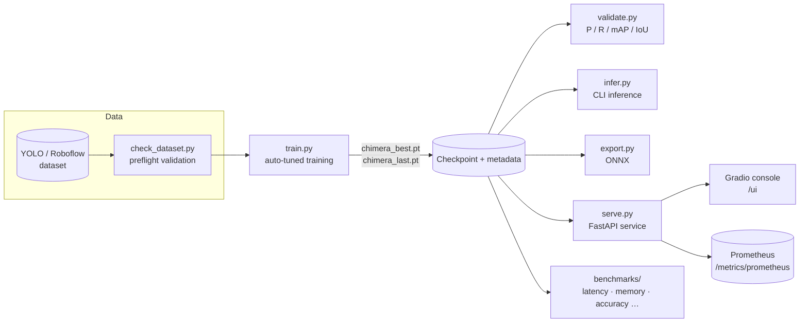
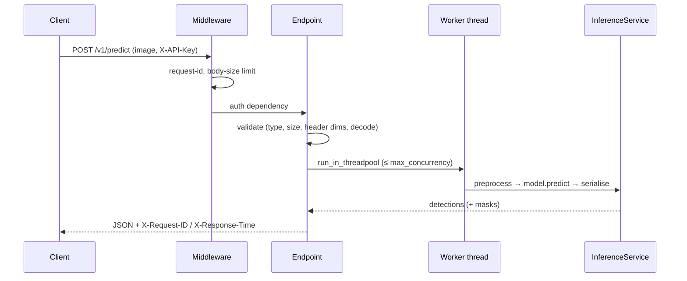

# Architecture

Detektor is a small, single-process system: a PyTorch model, a training loop, and a FastAPI/Gradio serving layer that
share the same checkpoint format. This page explains how the pieces fit together.

## System overview



## The model: ChimeraODIS

A lightweight, anchor-free, multi-task network producing boxes, class scores and instance masks from one forward pass.

```mermaid
flowchart LR
    IMG[Image<br/>B×3×H×W] --> BB[ChimeraBackbone<br/>stem + 4 RepCSP stages + SPPF-Lite]
    BB -->|P3 P4 P5| NECK[PAN-FPN neck]
    NECK -->|N3 N4 N5| HEAD[Decoupled detection head<br/>cls · box ltrb · objectness · mask coeffs]
    NECK -->|N3| PROTO[Prototype mask head<br/>K prototypes]
    HEAD --> DEC[Decode + score]
    PROTO --> MASK[Masks = σ(coeffs · protos)]
    DEC --> NMS[Top-k → class-aware NMS]
    NMS --> MASK
    NMS --> OUT[boxes · scores · labels · masks]
```

| Stage | Module | Notes |
| --- | --- | --- |
| Backbone | `models/blocks.py` | Conv-BN-SiLU stem, depthwise-separable + CSP-style residual blocks, SPPF-Lite pooling |
| Neck | `models/neck.py` | Top-down + bottom-up feature fusion at strides 8/16/32 |
| Head | `models/heads.py` | Anchor-free; per-point class, ltrb box distances, objectness, `K` mask coefficients |
| Masks | `models/heads.py`, `utils/mask_ops.py` | YOLACT-style prototype masks, cropped to the box, upsampled to the image |
| Loss | `losses/`, `utils/robust_loss.py` | CIoU + BCE (cls/obj) + BCE+Dice (masks); NaN-sanitised, AMP-safe |
| Post-processing | `utils/postprocess.py` | Top-k pre-NMS, class-aware NMS (pure-torch fallback), box rescaling |

### Architecture profiles

Six profiles scale the same design from CPU-only boxes to larger GPUs (`models/factory.py`). The training auto-config
picks one from available VRAM/RAM and dataset size; override with `--model <profile>`. Measured parameter counts, FLOPs
and speed per profile are in [BENCHMARKS.md](BENCHMARKS.md).

### Task modes

`detect` trains/serves boxes only; `segment` adds masks. The mode is auto-detected from the label format
(`utils/task_detection.py`). See [guides/TASK_MODES.md](guides/TASK_MODES.md).

## Checkpoints

A checkpoint is a plain `torch.save` dict carrying the weights **and** the metadata needed to rebuild the model, so
serving never needs the original config:

```
{ "model_state": …, "model_config": {profile, channels, depths, proto_k, num_classes, …},
  "config": <resolved train config>, "epoch": …, "best_metric": …, "format_version": 2 }
```

`models/factory.py::build_model_from_checkpoint` treats embedded metadata as authoritative, falling back to shape
inference for bare state dicts.

> **Trust boundary:** checkpoints are pickles. Only load files you produced or trust — see [SECURITY.md](../SECURITY.md).

## Serving layer



* **`serve.py`** — app factory, lifespan (load → warm-up → ready), middleware, endpoints, CLI/env configuration.
* **`api/inference.py`** — `InferenceService`: preprocessing, prediction, response shaping.
* **`api/validation.py`, `api/security.py`** — upload validation and optional API-key auth.
* **`api/metrics.py`** — thread-safe counters and a latency histogram (JSON + Prometheus).
* **`api/run_artifacts.py`** — discovers sibling `best`/`last` checkpoints and training artifacts for the UI and `/runtime`.
* **Hot-swap** — `POST /runtime/select_model` builds and warms a new `InferenceService`, then swaps the reference under
  a lock; in-flight requests finish on the old instance.

## Web console

`ui/app.py` (Gradio wiring) on top of `ui/render.py` (pure functions: annotation, HTML cards, charts — unit-tested
without a browser) and `ui/theme.py` (theme + CSS, light/dark). It runs in two modes: **in-process** (mounted by
`serve.py --ui`, calls the loaded model directly) and **remote** (`python -m ui.app`, talks to a running API over HTTP).

## Benchmarks

`benchmarks/` is a self-contained suite (`python -m benchmarks …`) with eleven suites, a Markdown reporter and a
regression comparator. Methodology: [BENCHMARKS.md](BENCHMARKS.md).

## Repository layout

```
api/            FastAPI schemas, inference service, validation, security, metrics, run-artifact discovery
benchmarks/     Benchmark framework (suites, synthetic data, report/compare CLI) + committed baseline results
configs/        Example training/validation YAML
datasets/       YOLO detection + segmentation dataset loader
docs/           Guides, references, architecture, benchmarks, internal notes
engine/         EMA
losses/         Detection and segmentation losses
metrics/        Detection / segmentation metrics
models/         ChimeraODIS: blocks, neck, heads, profile factory
scripts/        Packaging, ONNX export alias, reporting, smoke checks, legacy benchmark
tests/          Unit, integration, regression, API, UI and benchmark tests
ui/             Gradio console (app, render helpers, theme)
utils/          Config auto-tuning, checkpoints, postprocess, reporting, dataset validation, …
train.py  validate.py  infer.py  serve.py  export.py  check_dataset.py  model_matrix.py   # entry points
```
